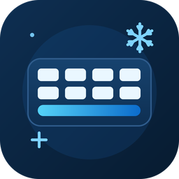

# InternalKeyfreeze

**中文** | [English](README.en.md)

<p align="center"></p>

冻结**笔记本内置键盘**、不影响**外置 USB / 蓝牙键盘**的 Windows 托盘小工具。
仿照 [OpenKeyfreeze](https://github.com/sukibaby/OpenKeyfreeze)，但把"一刀切锁全部键盘"改成了"只锁内置键盘"。

## 工作原理

| 方案 | 为什么不行 / 为什么可行 |
|------|------------------------|
| `WH_KEYBOARD_LL` 低级钩子（OpenKeyfreeze 的做法） | `KBDLLHOOKSTRUCT` 不含设备信息，**无法区分按键来自哪台键盘** |
| SetupAPI 设备级禁用 | 能禁用，但禁用后若程序崩溃/被强杀，设备会**持久保持禁用状态**（注册表 ConfigFlags 不随重启清除），内置键盘锁死、需手动恢复 |
| **Interception 内核过滤驱动**（本项目采用） | 驱动在内核键盘栈里拦截每个按键并**标注来源设备**，用户态程序据此放行外置键盘、吞掉内置键盘按键 |

每个按键的额外开销约 0.05ms，远低于 USB 轮询（8ms@125Hz）和人可感知阈值（约 50ms），打字、游戏无感。

## 系统要求与兼容性

### 支持的环境

| 项 | 要求 |
|----|------|
| 操作系统 | Windows 10 / 11 **64 位**（Interception 只有 x64 驱动） |
| 内置键盘 | **PS/2 接口**（ACPI 枚举，如 `ACPI\MSFT0001`、`ACPI\PNP0303`） |
| 外置键盘 | USB / 蓝牙键盘均可 |
| 权限 | 装驱动需管理员；日常运行无需管理员 |

> **确认内置键盘类型**：设备管理器 → 键盘 → 找到内置键盘 → 右键 → 属性 → 详细信息 → "设备实例路径"。如果以 `ACPI\` 开头就是 PS/2（支持）；以 `USB\` 或 `HID\` 开头就是 USB 接入（不支持，见下）。

### 不支持的环境

- **macOS**：Interception 是 Windows 内核驱动，macOS 用 XNU 内核，驱动模型完全不同，**无法移植**。MacBook 内置键盘也是 USB 接入，识别逻辑不适用。
- **内置键盘为 USB 接入的机型**（如部分 Surface、超薄本）：程序识别内置键盘的依据是"hwid 不含 `VID_`"（即非 USB 设备），USB 内置键盘的 hwid 含 `VID_`，会被误判为外置键盘而无法冻结。

### 装不上驱动？三大拦路虎

Interception v1.0.1 是 2018 年的驱动（项目已停更），在新版 Windows 上可能被以下机制拦截：

| 拦路虎 | 症状 | 解决方法 |
|--------|------|----------|
| **驱动签名强制**（Win10 1607+ 64位） | 驱动加载失败，`sc query keyboard` 显示 STOPPED | 管理员 CMD 运行 `bcdedit /set testsigning on` + 重启 |
| **Secure Boot**（BIOS） | 即使开了测试签名，驱动仍加载失败 | 进 BIOS 关闭 Secure Boot |
| **HVCI 内存完整性**（Win10 1809+） | 驱动加载失败，事件查看器报"不符合 HVCI 要求" | 设置 → 设备安全性 → 内核隔离 → 关闭"内存完整性" + 重启 |

> **判断驱动是否加载成功**：管理员 CMD 运行 `sc query keyboard`，应显示 `STATE: 4 RUNNING`。如果是 `STOPPED`，按上表排查。

### 识别不到内置键盘？

程序运行后内置键盘按键无反应、`InternalKeyfreeze.ini` 里 `hwid=` 为空，可能原因：

1. **内置键盘被禁用**（如之前运行过 v1 SetupAPI 方案未正常退出，或手动在设备管理器禁用过）
   - 设备管理器 → 查看 → 显示隐藏的设备 → 键盘 → PS/2 标准键盘（灰色图标）→ 右键 → 启用设备
   - 或管理员 PowerShell：`Enable-PnpDevice -InstanceId "ACPI\MSFT0001\4&6ea17be&0" -Confirm:$false`（实例 ID 按实际替换）
2. **内置键盘走 USB 接口**：见上方"不支持的环境"
3. **驱动没加载**：按上方"三大拦路虎"排查

## 目录结构

```
InternalKeyfreeze\
├─ README.md                    本文件（中文）
├─ README.en.md                 英文版 readme
├─ LICENSE                      MIT 许可证（本项目代码）
├─ build_icons.bat              重新生成图标资源（编译前运行，详见下方）
├─ 安装.bat                     一键安装（双击即可，自动提权）
├─ 卸载.bat                     一键卸载（双击即可，自动提权）
├─ Interception.zip             Interception v1.0.1 官方发布包（存档）
├─ assets\                      图标源与生成产物（icon-master.png / *.ico / 展示用 png）
├─ build\                       编译中间产物（.o / .res，已在 .gitignore 忽略）
├─ bin\
│   ├─ InternalKeyfreeze.exe    主程序（日常使用就点它）
│   └─ interception.dll         运行库（必须与 exe 同目录）
├─ driver\
│   ├─ install-driver.bat       安装驱动（右键→以管理员身份运行，仅一次）
│   ├─ UninstallDriver.exe      卸载驱动（双击，弹 UAC）
│   └─ install-interception.exe 官方驱动安装器（装/卸共用，被上面两个调用）
├─ src\
│   ├─ InternalKeyfreeze.cpp    主程序源码
│   ├─ InternalKeyfreeze.rc     Windows 资源脚本（图标定义）
│   ├─ resources.h              资源 ID 头文件
│   ├─ UninstallDriver.cpp      卸载器源码
│   ├─ UninstallDriver.manifest 卸载器 UAC manifest
│   └─ legacy\                  v1 存档（SetupAPI 禁用方案，本机不可用）
└─ sdk\                         Interception SDK（头文件 / lib / 许可证 / 示例）
```

## 安装

### 方式一：一键安装（推荐，普通用户用这个）

从 [GitHub Release](https://github.com/gziyin/InternalKeyfreeze/releases) 下载 `InternalKeyfreeze-v2.0.zip`，解压后：

1. **双击 `安装.bat`**（会自动弹 UAC，确认即可）
2. **重启电脑**

安装脚本会自动完成：装驱动 → 复制文件到 `C:\Program Files\InternalKeyfreeze\` → 创建桌面/开始菜单快捷方式。重启后双击桌面快捷方式即可运行。

### 方式二：手动安装（开发者用这个）

1. 右键 `driver\install-driver.bat` → **以管理员身份运行**
2. **重启电脑**（过滤驱动开机加载，必须重启）

## 使用

1. 运行 `bin\InternalKeyfreeze.exe`（无需管理员）
2. 首次左键托盘图标 → 提示"请在内置键盘上按任意键" → 按一下笔记本键盘任意键
   → 硬件 ID 记录到 `bin\InternalKeyfreeze.ini`，并立即冻结
3. 之后**左键**托盘图标 = 冻结 / 恢复切换；**右键** = 重新识别 / 退出
4. 程序退出或崩溃时驱动自动恢复输入，内置键盘永远不会被锁死；Ctrl+Alt+Del 始终可用

## 卸载

### 方式一：一键卸载（推荐）

双击 `卸载.bat`（自动提权）→ 自动结束程序、卸载驱动、删除 `C:\Program Files\InternalKeyfreeze\`、清理快捷方式 → 重启后彻底移除。

### 方式二：手动卸载

双击 `driver\UninstallDriver.exe`（弹 UAC 确认）→ 它会自动结束正在运行的
InternalKeyfreeze、调用官方安装器卸载驱动，并询问是否立即重启。
**重启后**驱动彻底移除。程序本体留在 `bin\`，删除整个项目文件夹即可完全清理。

## 重新编译

主程序（无需链接任何库，dll 运行时动态加载）。图标通过 Windows 资源脚本 `src/InternalKeyfreeze.rc` 嵌入 exe，需先用 `build_icons.bat` 生成 `assets/*.ico`（首次克隆或想换图标时运行一次）。

```bat
:: 1) 生成图标资源（首次 / 修改图标后）
build_icons.bat

:: 2) MSVC —— 编译资源并链接
rc src\InternalKeyfreeze.rc
cl /EHsc /W4 src\InternalKeyfreeze.cpp src\InternalKeyfreeze.res /link /SUBSYSTEM:WINDOWS /OUT:bin\InternalKeyfreeze.exe

:: 3) MinGW-w64 —— 资源编译为 COFF 并链接
windres --output-format=coff -i src\InternalKeyfreeze.rc -o build\InternalKeyfreeze.res.o
g++ -O2 -municode -mwindows src\InternalKeyfreeze.cpp build\InternalKeyfreeze.res.o -o bin\InternalKeyfreeze.exe
```

> `build\` 为编译中间目录（已在 `.gitignore` 中忽略），不会进入仓库。

卸载器（需内嵌 manifest，MinGW 示例）：

```bat
cd src
printf '1 24 "UninstallDriver.manifest"\n' > ud.rc
windres ud.rc -O coff -o ud.res
g++ -O2 -municode -mwindows UninstallDriver.cpp ud.res -o ..\driver\UninstallDriver.exe
del ud.rc ud.res
```

## 依赖与许可

- **Interception** by oblitum — https://github.com/oblitum/Interception （v1.0.1）
  键盘/鼠标内核过滤驱动。非商用使用遵循 **LGPL 3.0**（见 `sdk\licenses\`），
  商用需购买商业许可。原始发布包存档于 `Interception.zip`。
- 本项目自身代码随意使用。
